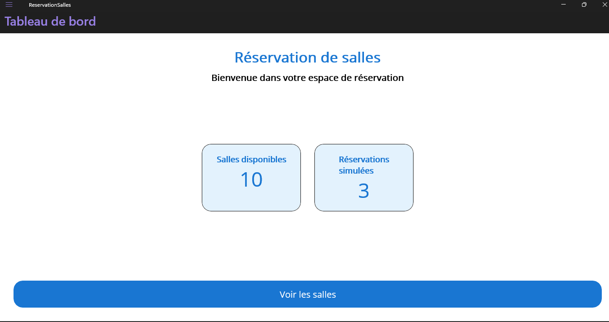
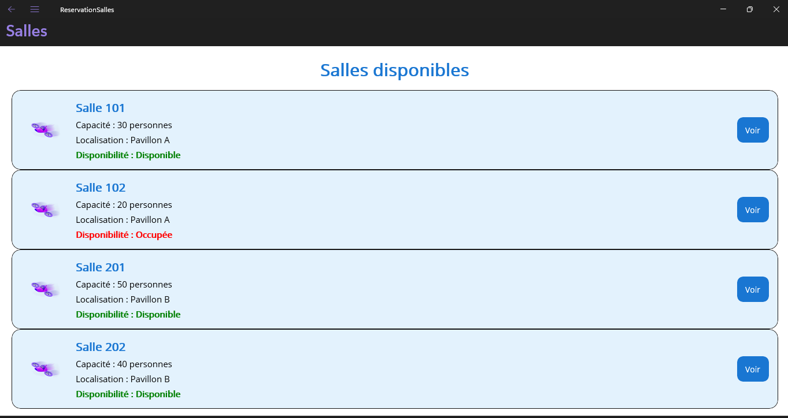
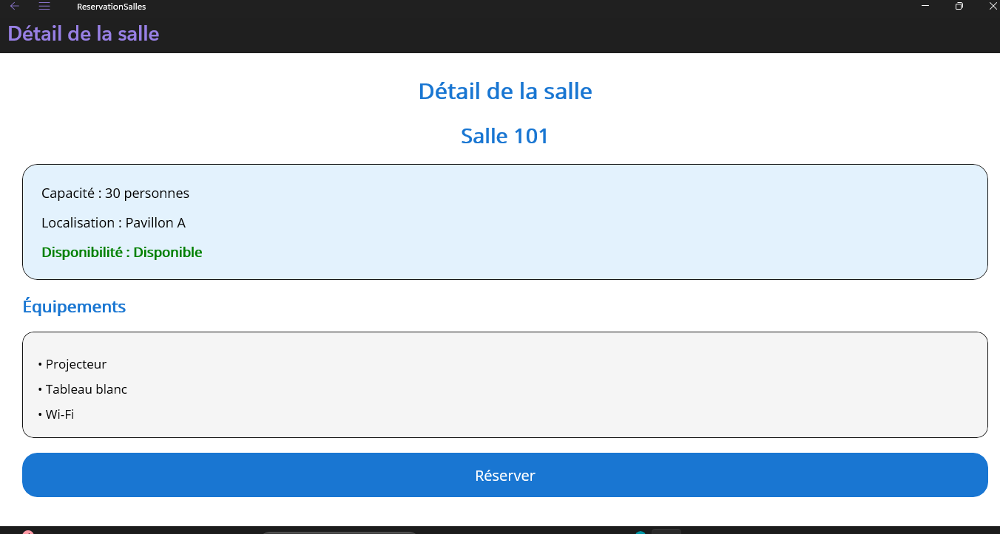

# ReservationSalles

Application .NET MAUI de réservation de salles.

## Fonctionnalités réalisées

### Tableau de bord

- Affichage du nombre de salles disponibles
- Affichage des réservations simulées
- Accès à la liste des salles

### Liste des salles

- Affichage des salles
- Capacité de chaque salle
- Localisation
- Disponibilité
- Bouton pour consulter les détails

### Détail d'une salle

- Nom de la salle
- Capacité
- Localisation
- Disponibilité
- Équipements disponibles

## Technologies utilisées

- C#
- .NET MAUI
- XAML
- Visual Studio 2022
- GitHub

## Projet

Projet réalisé dans le cadre du cours de programmation.

## Captures d'écran

### Tableau de bord

### Liste des salles

### Détail d'une salle

