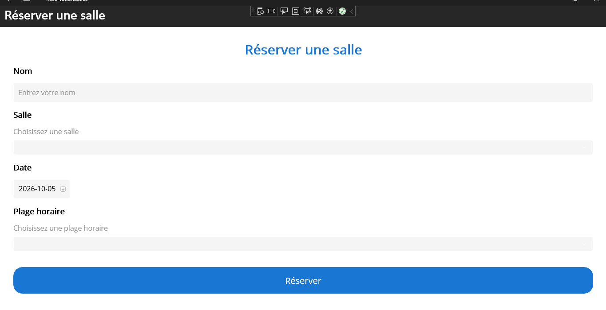
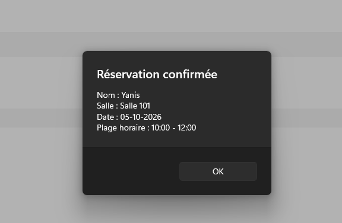

# ReservationSalles

Application .NET MAUI permettant de consulter les salles disponibles et de simuler leur réservation.

## Présentation du projet

ReservationSalles est une application développée avec .NET MAUI dans le cadre du cours de programmation.

L'application permet de consulter les salles, d'afficher leurs informations détaillées et de simuler une réservation à l'aide d'un formulaire.

Les données utilisées dans l'application sont des données de démonstration. Les réservations ne sont pas enregistrées dans une base de données.

## Fonctionnalités

### Tableau de bord

Le tableau de bord permet de :

- Afficher le nombre de salles disponibles
- Afficher le nombre de réservations simulées
- Accéder à la liste des salles

### Liste des salles

La liste affiche les informations principales de chaque salle :

- Nom de la salle
- Capacité
- Localisation
- Disponibilité
- Équipements
- Bouton pour consulter les détails

Les salles utilisées dans l'application sont :

- Salle 101
- Salle 102
- Salle 201
- Salle 202

### Détail d'une salle

La page de détail permet de consulter :

- Le nom de la salle
- La capacité
- La localisation
- La disponibilité
- Les équipements disponibles

Un bouton **Réserver** permet d'accéder au formulaire de réservation.

### Réservation

Le formulaire de réservation permet de saisir :

- Le nom de l'utilisateur
- La salle
- La date
- La plage horaire

Lorsque l'utilisateur accède au formulaire depuis la page de détail, la salle sélectionnée est automatiquement transmise au formulaire.

### Validation

Le formulaire vérifie les informations nécessaires avant de confirmer la réservation.

Les informations vérifiées sont :

- Le nom de l'utilisateur
- La salle sélectionnée
- La plage horaire

Une alerte est affichée lorsqu'une information obligatoire est manquante.

Après une saisie valide, une confirmation affiche :

- Le nom de l'utilisateur
- La salle
- La date
- La plage horaire

## Navigation

Le parcours principal de l'application est :

```text
Tableau de bord
       ↓
Liste des salles
       ↓
Détail d'une salle
       ↓
Réserver
       ↓
Formulaire de réservation
       ↓
Confirmation
```

## Technologies utilisées

- C#
- .NET MAUI
- XAML
- Visual Studio 2022
- GitHub

## Structure du projet

```text
ReservationSalles
│
├── Images
│   ├── dashboard.png
│   ├── salles.png
│   ├── salle-detail.png
│   ├── reservation.png
│   └── reservation-confirmation.png
│
├── Models
│   └── Salle.cs
│
├── Pages
│   ├── DashboardPage.xaml
│   ├── DashboardPage.xaml.cs
│   ├── SallesPage.xaml
│   ├── SallesPage.xaml.cs
│   ├── SalleDetailPage.xaml
│   ├── SalleDetailPage.xaml.cs
│   ├── ReservationPage.xaml
│   └── ReservationPage.xaml.cs
│
├── Platforms
│
├── Resources
│   └── Styles
│
├── App.xaml
├── App.xaml.cs
├── AppShell.xaml
├── AppShell.xaml.cs
└── README.md
```

## Navigation entre les pages

La navigation de l'application utilise `AppShell` et les routes .NET MAUI.

Les principales pages sont :

- `DashboardPage`
- `SallesPage`
- `SalleDetailPage`
- `ReservationPage`

La salle sélectionnée est transmise de `SalleDetailPage` vers `ReservationPage`.

## Captures d'écran

### Tableau de bord


### Liste des salles


### Détail d'une salle


### Formulaire de réservation



### Confirmation de réservation



## Guide d'exécution

1. Ouvrir le projet `ReservationSalles` dans Visual Studio 2022.
2. Vérifier que .NET MAUI est installé.
3. Ouvrir la solution du projet.
4. Sélectionner **Windows Machine** comme cible d'exécution.
5. Appuyer sur **F5** pour lancer l'application.
6. Le tableau de bord s'affiche au démarrage.
7. Cliquer sur **Voir les salles**.
8. Sélectionner une salle et cliquer sur **Voir**.
9. Consulter les détails de la salle.
10. Cliquer sur **Réserver**.
11. Entrer le nom de l'utilisateur.
12. Vérifier la salle sélectionnée.
13. Choisir une date.
14. Choisir une plage horaire.
15. Cliquer sur **Réserver**.
16. Une confirmation de réservation s'affiche.

## Données

Les salles utilisées dans l'application sont des données de démonstration.

Les réservations sont simulées et ne sont pas sauvegardées dans une base de données.

## Projet

Projet réalisé dans le cadre du cours de programmation avec .NET MAUI.